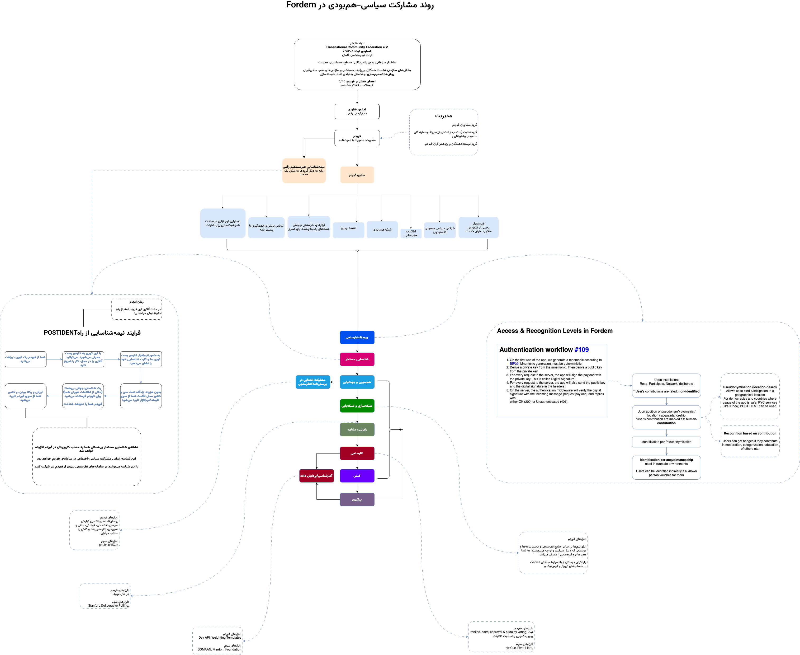

# Fordem | for democracy | برای مردم‌گردانی
## A censorship-resistant digital emocracy platform  
  
Fordem, an abbreviation of ‘for democracy’ is a digital democracy and socio-political mobilisation platform, with participation, deliberation, and networking functionalities.  
Fordem app (WIP) forms independent WiFi-Direct networks when the internet and cellular networks are down, respects privacy and is oriented toward maximum data security. Fordem aims to maximise the impact of civil society.
  
**Who is behind the project?**  
We are based at tech department of the civic innotavation lab [TCF e. V.](https://transcf.org)  
We are a member of [Vernetzung Bürger:Innenbeteiligung](https://wechange.de/group/vernetzung-buergerinnenbeteiligung/) and an active member of Iranian Woman Life Freedom movement.  
We actively look for new developers, members of board of trustess and external auditors. [Get involved](https://github.com/tcfev/Fordem/discussions/52)

**Fordem short-term goals:**  
Fordem is a tool for development of any community as it can be adapted to the respective needs and contexts. In our first version we aim to assist Iranian political activists in networking, deliberation and participation stages of their mobilisation along the ongoing Woman, Life, Freedom movement.  

Furthermore, we are invested in implementing Fordem in communities in Germany suffering from a democratic gap. Our main forcus ther is Heilbronn, a city with more than 54% of the population with migratory background but only 5% of the seats in the municipal council.

Our long-term goal is to adapt Fordem for various democratic needs of every community around the world and to connect these communities to an interconnected and transnationally aware whole. 
  
**How are we going to do that?**  
Fordem is an open-source platform, it is developed in direct collaboration with the civil society, has a crypto economy that gives back to the users if any profit is generated e.g. when news agencies pay to use the survey results (yes, it's not free for those!), provides the users with community building and organisation tools, and is hosted and managed by a non-profit federation.  
  
**Activists will have the possibility to:** (Diaspora in case of Iran)
- Identify themselves through a pseudonymisation process done by a trusted 3rd parties
- Create and interactively flesh out their multifaceted profiles
- Connect with like-minded people and groups 
- Organise events and meetings  
- Collaboratively ideate
- Utilise various socials functions to find the social choice 
- Find and form representative groups for more elaborate democratic processes e.g. deliberation  
  
**Data**  
Everything is treated according to the GDPR. We do not store or keep PII without users' explicit request.  
Furthermore the Data generated by the users will in part go on chain using smart contracts, or stored on a federated system. That said, using different licensing techniques we ensure for-profit organisations pay for their usage of the output and the profit goes back to users who generated the value as well as to the further development of the platform to reflect the users' needs.  

Want to Join?: [`check here`](https://github.com/tcfev/Fordem/issues/61)  & [`this discussion`](https://github.com/tcfev/Fordem/discussions/52)  

#
* [Organisation & Component Overview](https://github.com/tcfev/fordem/blob/main/.assets/organisation.md) (EN)

* Organisation & Component Overview (فارسی):  
  

* [Our Values & principles](https://github.com/tcfev/fordem/issues/57)
* [Protocols](https://github.com/tcfev/fordem/tree/main/.assets/.protocols)
#

**UI Design**  (WIP)
* [Figma design](https://www.figma.com/file/VHFRoqXfhc2ThZQMZUXcje/%D8%A8%D8%B1%D8%A7%DB%8C-%D9%85%D8%B1%D8%AF%D9%85%E2%80%8C%D8%B3%D8%A7%D9%84%D8%A7%D8%B1%DB%8C%2Ff%C3%BCrDem?node-id=0%3A1)  
* [UX-flowchart](https://github.com/tcfev/Fordem/blob/main/.assets/ux-flowchart.md) 
* [Brand-identity](https://github.com/tcfev/Fordem/blob/main/.assets/brand-identity.md)  
