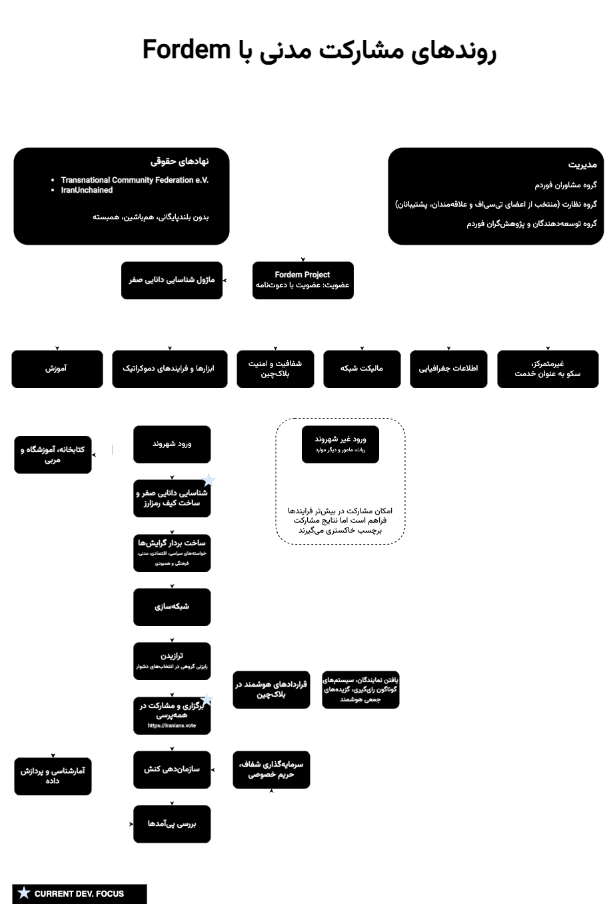

# Fordem | for democracy | برای مردم‌گردانی
## A censorship-resistant digital emocracy platform  
  
Fordem, an abbreviation of ‘for democracy’ is a digital democracy and socio-political mobilisation platform, with participation, deliberation, and networking functionalities.  
Fordem app (WIP) forms independent WiFi-Direct networks when the internet and cellular networks are down, respects privacy and is oriented toward maximum data security. Fordem aims to maximise the impact of civil society.
  
**Who is behind the project?**  
We are based at tech department of the civic innotavation lab [TCF e. V.](https://transcf.org)  
We are a member of [Vernetzung Bürger:Innenbeteiligung](https://wechange.de/group/vernetzung-buergerinnenbeteiligung/) and an active member of Iranian Woman Life Freedom movement.  
We actively look for new developers, members of board of trustess and external auditors. [Get involved](https://github.com/tcfev/Fordem/discussions/52)

**Fordem short-term goals:**  
Fordem is a tool for development of any community as it can be adapted to the respective needs and contexts. In our first version we aim to assist Iranian political activists in networking, deliberation and participation stages of their mobilisation along the ongoing Woman, Life, Freedom movement.  

Furthermore, we are invested in implementing Fordem in communities in Germany suffering from a democratic gap. Our main forcus ther is Heilbronn, a city with more than 54% of the population with migratory background but only 5% of the seats in the municipal council.

Our long-term goal is to adapt Fordem for various democratic needs of every community around the world and to connect these community to an interconnected and transnationally aware whole. 
  
**How are we going to do that?**  
Fordem is an open-source platform, it is developed in direct collaboration with the civil society, has a crypto economy that gives back to the users if any profit is generated e.g. when news agencies pay to use the survey results (yes, it's not free for those!), provides the users with community building and organisation tools, and is hosted and managed by a non-profit federation.  
  
**Activists will have the possibility to:** (Diaspora in case of Iran)
- Identify themselves through a pseudonymisation process done by a trusted 3rd parties
- Create and interactively flesh out their multifaceted profiles
- Connect with like-minded people and groups 
- Organise events and meetings  
- Collaboratively ideate
- Utilise various socials functions to find the social choice 
- Find and form representative groups for more elaborate democratic processes e.g. deliberation  
  
**Data**  
Everything is treated according to the GDPR. We do not store or keep PII without users' explicit request.  
Furthermore the Data generated by the users will in part go on chain using smart contracts, or stored on a federated system. That said, using different licensing techniques we ensure for-profit organisations pay for their usage of the output and the profit goes back to users who generated the value as well as to the further development of the platform to reflect the users' needs.  

Want to Join?: [`check here`](https://github.com/tcfev/Fordem/issues/61)  & [`this discussion`](https://github.com/tcfev/Fordem/discussions/52)  

#
* [Organisation & Component Overview](https://github.com/tcfev/fordem/blob/main/.assets/organisation.md) (EN)

* Organisation & Component Overview (فارسی):  

* [Our Values & principles](https://github.com/tcfev/fordem/issues/57)
* [Protocols](https://github.com/tcfev/fordem/tree/main/.assets/.protocols)
#
**Platforms**
- Android, iOS, Web, Linux, Windows and MacOS
#
**Connected APIs**
- Part of Fediverse
#
**UI Design**  
* [Figma design](https://www.figma.com/file/VHFRoqXfhc2ThZQMZUXcje/%D8%A8%D8%B1%D8%A7%DB%8C-%D9%85%D8%B1%D8%AF%D9%85%E2%80%8C%D8%B3%D8%A7%D9%84%D8%A7%D8%B1%DB%8C%2Ff%C3%BCrDem?node-id=0%3A1)  
* [UX-flowchart](https://github.com/tcfev/Fordem/blob/main/.assets/ux-flowchart.md) - work-in-progress
* [Brand-identity](https://github.com/tcfev/Fordem/blob/main/.assets/brand-identity.md) - work-in-progress  
#
**Domain model - todo**  
#
**Standards - todo**  
- `Suggestion` for user-centred design processes and extension of UI/UX concept
    * `ISO 13407:1999.`
- `Suggestion` for design of the system architecture
    * `ISO/IEC 25010:2011, CD 25019.3`
---
** Digital democracy platforms and how Fordem stands out**  

Every digital democracy platform must have the following four core functionlities/features fully fledged in it: 
- `Transparency`
- `Networking`
- `Deliberation`
- `Participation`

**This makes Fordem unique:**  
* Next to the four core pillars mentioned above Fordem will offer:  
- `interest vector`
- `official, acquaintanceship and reputation-based pseudonymisation`  
- `peer-to-peer connectivity`  
- `decentralised storage`
- `onion-routing`
- `integrated crypto economy`

---
#### Platform architecture

---
#### P2P, DHT & Synchronization
We have two main parts that relate to the P2P functionalities  
- P2P mode  
- Local NoSQL database  
  
Once there is no internet connection available (and the app is set to discover or form mesh networks/other peers), if P2P connection is established, the local databases of the adjacent apps will be compared and synchronised. This can happen through a comparison of the lists of keys(UUIDs) of the two databases, and if there is a difference, a union of the differing key:values will be shared between the two apps. Goal here is to send as small yet meaningful pieces of data as the Mesh network can handle. The exchanged data will is end-to-end encrypted.
Here are the mesh protocol’s specification and situation of the peers, the defining factor.  
If the network is healthy, the size of the chunk of data that is going to be shared, increases.  
In version one synchronisation takes place between the databases of each two apps (with intermediary nodes or without) that have differing tables. In later versions, a more efficient method will be chosen.  
One main goal is to regularly check & report the level of synchronicity until the network is stabilised and all the data is available on all apps. However smaller chunks of fully synchronised data (individual entities) are still valuable.  
So, long story short, synchronising the NoSQL databases of the peers in the most efficient way is the goal.
  

---

## Roadmap
**internet**
 - [x] Mastadon compatibility API: A gRPC server written C# with REST extension compatible with Mastadon's REST API
 - [x] Port & Extend Mastadon's REST API with new features implemented in C# (as a micro service) 
 - [x] Generate Frontend -[Nextodon-ui](https://github.com/tcfev/nextodon-ui) & [Nextodon-ui](https://github.com/tcfev/nextodon-UI-old)
	 - Generate client-side API
	 - Develop UI for the Flutter App - just a scaffold. other UI Devs can then customize this.

**P2P**
- Embedd [nRF-Mesh-Library-Android](https://github.com/NordicSemiconductor/Android-nRF-Mesh-Library) 
- Embedd nRF-Mesh-Library-iOS
- Couple client-side APIs
- Implement Local Communication System over Wi-Fi Direct based on [Fuliang Li et al.](https://ieeexplore.ieee.org/document/9011605), António [Teófilo et al.](https://www.researchgate.net/publication/352213057_RedMesh_A_WiFi-Direct_Network_Formation_Algorithm_for_Large-Scale_Scenarios)

**Synchronization (DHT)** - todo

---
¹ Organizations/networks/individuals that are consistant with values around human rights and UN development goals. Also see: [Our Values & principles](https://github.com/tcfev/Fordem/issues/57)

